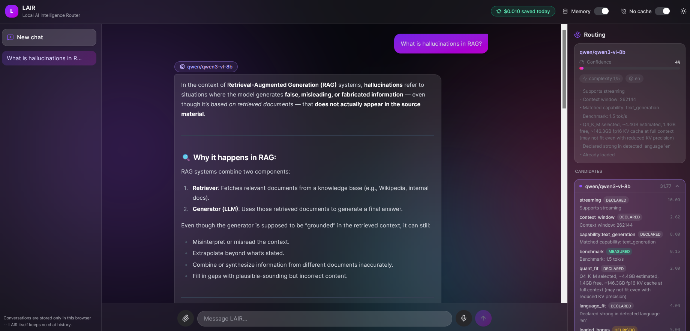
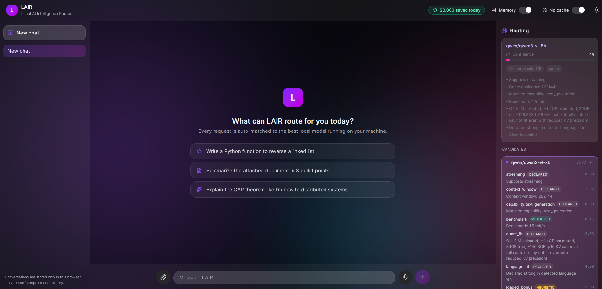
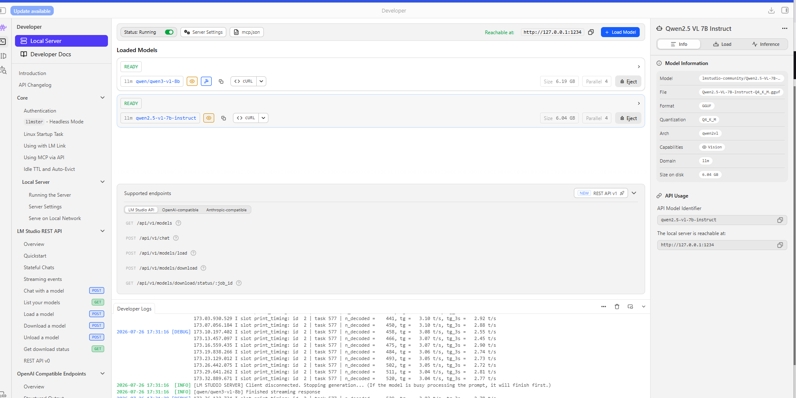
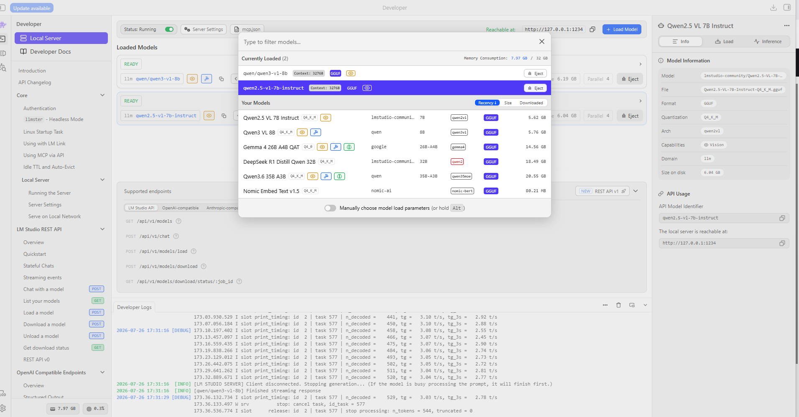

# LAIR — Local AI Intelligence Router

> **Build intelligently. Measure everything. Evolve continuously.**

[](LICENSE)
[](https://www.python.org/)
[](CHANGELOG.md)
[](#privacy--why-local-first)
[](INSTRUCTIONS.md)

> **Your prompts never leave your machine.** LAIR runs entirely on hardware you own,
> talking only to a local inference backend (LM Studio) on `localhost`. No account,
> no telemetry, no cloud call — unless you deliberately opt into the budget-capped
> cloud escalation feature, which is off by default. See
> [Privacy & why local-first](#privacy--why-local-first).

---

## Overview

Today's AI developers often work with multiple local language models.

One model excels at coding.

Another performs better at reasoning.

A third specializes in vision.

A fourth handles long-context documentation.

Choosing the right model manually is inefficient and gets harder as the number of available models grows.

**LAIR (Local AI Intelligence Router)** solves this by automatically selecting the most appropriate local AI model for every task — capability-aware, benchmark-driven, explainable, and local-first.

Rather than asking:

> "Which model should I use?"

Users simply describe the task.

LAIR decides the rest.

---

## Screenshots

<table>
<tr>
<td width="50%">

**LAIR web UI — routing panel**
Every request shows the full decision: candidate models, per-factor scores,
provenance tags, and confidence — before you ever see the answer.



</td>
<td width="50%">

**LAIR web UI — home**
Streaming chat, voice in/out, document drag-and-drop, and a routing panel —
all running against your own machine, nothing sent anywhere else.



</td>
</tr>
<tr>
<td width="50%">

**LM Studio — models ready to route to**
LAIR drives LM Studio headlessly (auto-start, auto-load, auto-evict) — this
is what's running underneath, entirely on your machine.



</td>
<td width="50%">

**LM Studio — model catalog**
Your downloaded models, sizes, and quantizations — LAIR reads this catalog
to decide who's the best fit for each request.



</td>
</tr>
</table>

---

# Why LAIR?

Two missions drive every decision in this project:

- **Affordability** — most AI work should run on models you already own; cloud usage is a tightly budgeted exception, never the default.
- **Accessibility** — LAIR should run well on an ordinary 8–16GB laptop, not just a 64GB workstation.

In service of that:

| Task | Example Models |
|-------|----------------|
| Coding | Qwen3.6 |
| Documentation | Gemma 4 |
| Deep Reasoning | DeepSeek-R1 |
| Vision | Qwen2.5-VL |
| Fast Assistance | Qwen3 8B |

Instead of manually switching models, LAIR automatically selects the best execution strategy — and tells you why.

---

# Privacy & why local-first

LAIR's entire premise is that you should not have to trade your data — or your
wallet — for good AI assistance.

- **Nothing leaves your machine.** LAIR and LM Studio both run on `localhost`.
  Your prompts, your documents, your code — none of it is sent to a cloud API,
  logged externally, or used to train anything.
- **No account, no telemetry, no phone-home.** There's nothing to sign up for
  and nothing reporting usage back to anyone.
- **Cloud is opt-in, capped, and never silent.** The only exception is the
  optional hybrid cloud escalation feature (`ENABLE_CLOUD_ESCALATION`), which
  is **off by default**. If you turn it on and set a budget, only genuinely
  hard requests may escalate — and every such response is explicitly labeled
  `lair_meta.routed_to_cloud=true`, never silent.
- **All you need is a laptop.** `lair doctor` profiles your actual RAM, GPU,
  and disk, then recommends a model portfolio sized to fit — LAIR is built to
  run well on an ordinary 8–16GB machine, not just a high-end workstation.
- **Everything is inspectable and revocable.** Local memory, cached
  responses, and ingested documents are stored as plain local files you can
  read, export, or delete — see `lair memory list/show/forget/export` in
  [INSTRUCTIONS.md](INSTRUCTIONS.md#project-memory).

---

# What's Actually Working Today

Every item below is implemented, tested, and merged — not a roadmap aspiration.

**Routing & explainability**
- Capability-aware, hardware-aware, benchmark-driven model selection
- Every scoring factor carries a provenance tag (`MEASURED` / `COMMUNITY` / `DECLARED` / `HEURISTIC` / `MEMORY`), so you know whether a score came from a real measurement on your machine or a declared default
- Rules-based and (optional) model-assisted task complexity triage
- Language-aware routing — a request in Spanish, Hindi, Arabic, etc. is scored toward the model documented as strongest in that language
- Battery-aware routing bias on laptops
- Streaming-aware routing *infrastructure* (real SSD-speed hardware signal, registry schema, routing-side allowance) — the actual SSD-streaming execution path needs a future llama.cpp-direct provider and is honestly not built yet

**Cost & efficiency**
- Savings dashboard (`GET /v1/lair/savings`) estimating cloud-equivalent cost avoided by routing locally
- Quantization-aware scoring and KV-cache-aware memory fit, so routing accounts for weights *and* KV cache at your configured context length
- Single-slot model scheduler with role-aware TTLs, cooperating with LM Studio's own JIT loading / Auto-Evict
- Optional, hard-budget-capped hybrid cloud escalation for genuinely hard requests — off by default, never silent when it fires

**Onboarding & developer experience**
- `lair doctor` profiles your machine (RAM, GPU, SSD speed) and recommends a tiered model portfolio
- `lair install` writes IDE client configs (Continue, with more clients planned) pointing at LAIR automatically
- OpenAI-compatible `/v1/chat/completions` and `/v1/models`, including streaming — works with Continue, Cline, or any OpenAI-compatible client today
- A local web UI (`web/`) — streaming chat, voice in/out, document drag-and-drop, conversation history, and a live routing panel showing per-candidate scores and provenance for every request

**Memory, documents & voice**
- Persistent, per-project local memory (`lair memory`) — LAIR remembers durable facts/preferences across sessions and tools, fully local, off by default, fully inspectable and revocable
- RAG-lite document ingestion (`POST /v1/lair/documents`) — ask questions over documents larger than a model's context window, using local embeddings (no cloud, no external vector DB)
- Response caching for repeated exact requests
- Optional fully local voice interface (`POST /v1/audio/transcriptions`, `POST /v1/audio/speech`, `lair voice`) — ships as an optional extra so the core install stays light

**Community & research**
- Opt-in community capability database — anonymized benchmark scores from similar hardware fill in for models you haven't measured yourself; your own local measurements always win
- Phase 1 research validating tensor-network (MPO) model compression math, with an honestly-reported finding about what it does and doesn't prove yet

See `CHANGELOG.md` for the full, dated history of every feature above, and `docs/adr/` / `docs/rfcs/` for the design decisions behind them.

---

# High-Level Architecture

```
                  User / IDE / Voice
                          │
                          ▼
                 Capability Engine
                          │
                          ▼
                  Routing Engine
         (hardware fit, quant/KV fit, benchmarks,
          complexity, language, battery, community)
                          │
            ┌─────────────┼─────────────┐
            ▼             ▼             ▼
         Qwen          Gemma        DeepSeek
    (local, via LM Studio)      (cloud, opt-in, budget-capped)
            │             │             │
            └─────────────┼─────────────┘
                          ▼
                   Best Response
       (+ project memory, RAG context, savings estimate)
```

---

# Project Structure

```
LAIR/

├── app/            application code (routing, providers, models, execution, memory, RAG, voice)
├── lair/           CLI package (doctor, install, memory, voice, community)
├── web/            local web UI -- React + Vite + TypeScript (chat, voice, documents, routing panel)
├── scripts/        utility scripts (benchmarks, compactify research pipeline)
├── benchmarks/
├── configs/        portfolios, pricing, language strengths, community scores, compact models
├── docs/           product vision, architecture, ADRs, RFCs, research, innovation plan
├── logs/
├── prompts/
├── tests/

├── README.md
├── ROADMAP.md
├── CHANGELOG.md
├── CONTRIBUTING.md
├── INSTRUCTIONS.md
├── LICENSE
```

---

# Documentation

The complete project documentation is located in the **docs/** directory.

Start here:

```
docs/index.md
```

Documentation includes:

- Product Vision
- Project Charter
- Engineering Handbook
- Architecture
- Routing Engine
- Model Registry
- Provider Architecture
- API Specification
- Benchmarking Framework
- ADRs (`docs/adr/`)
- RFCs (`docs/rfcs/`)
- Research
- Innovation Backlog and active Innovation Plan (`docs/INNOVATION_PLAN_2026.md`)

---

# Current Model Portfolio

| Role | Model |
|------|-------|
| Coding | Qwen3.6 35B A3B |
| Documentation | Gemma 4 26B A4B |
| Deep Reasoning | DeepSeek-R1 Distill Qwen 32B |
| Vision | Qwen2.5-VL 7B |
| Fast Assistant | Qwen3 8B |

`lair doctor` recommends a different, lighter portfolio automatically on 8–16GB machines — see `configs/portfolios/`.

---

# Technology Stack

- Python 3.13+
- FastAPI, Uvicorn, Pydantic, HTTPX
- LM Studio (local inference backend)
- `fastembed` (local embeddings for memory/RAG/cache — ONNX Runtime, no torch)
- `langdetect` (language-aware routing)
- React, Vite, TypeScript, Tailwind CSS (`web/` — local web UI, talks directly to the API above)

Optional extras:

- `faster-whisper` + `kokoro-onnx` (`requirements-voice.txt`) for the voice interface
- `tensorly` (test-only) for the compact-models research pipeline

Planned:

- Ollama, vLLM, a llama.cpp-direct provider (for real SSD-streaming execution)
- Docker, Kubernetes

---

# Development Status

Current Version

```
0.3.0-alpha
```

Current Phase

```
Intelligent Routing complete; Benchmark Engine in progress
```

Next Milestone

```
Router Decision Accuracy measurement (see docs/innovation_backlog.md)
```

---

# Roadmap

| Version | Focus |
|----------|-------|
| 0.1 | Architecture Foundation |
| 0.2 | Capability Engine |
| 0.3 | Intelligent Routing |
| 0.4 | Benchmark Engine |
| 0.5 | Multi-Provider |
| 0.6 | Learning Engine |
| 1.0 | Public Release |

More details are available in:

```
ROADMAP.md
```

---

# Quick Start

Clone the repository

```bash
git clone https://github.com/Najam0786/LAIR-Local-AI-Router.git
```

Create a virtual environment

```bash
python -m venv .venv
```

Activate

Windows

```powershell
.\.venv\Scripts\Activate.ps1
```

Install dependencies

```bash
pip install -r requirements.txt
```

Profile your machine and get a recommended model portfolio

```bash
python -m lair doctor --init
```

Start the server

```bash
uvicorn main:app --reload
```

Open

```
http://localhost:8000/docs
```

For LM Studio setup, connecting a chat client (e.g. Continue), configuration
options, and troubleshooting, see **[INSTRUCTIONS.md](INSTRUCTIONS.md)**.

---

# CLI

```
python -m lair doctor [--init]        # profile this machine, recommend a portfolio
python -m lair install [--client X]   # point an IDE client at LAIR automatically
python -m lair memory list|show|forget|export SCOPE   # inspect/manage project memory
python -m lair voice --input in.wav --output out.wav  # file-based voice round trip
python -m lair community export --tier TIER           # anonymized benchmark export
```

---

# Web UI

A local web client lives in `web/` — streaming chat, voice in/out, drag-and-drop
documents, conversation history, and a live routing panel showing exactly how
each request was scored (candidates, per-factor provenance, confidence).

With the backend already running (`uvicorn main:app --reload`):

```bash
cd web
npm install
npm run dev
```

Open the URL Vite prints (typically `http://localhost:5173`). See
[web/README.md](web/README.md) for details.

---

# Engineering Philosophy

LAIR follows a structured engineering workflow.

```
Innovation

↓

Research

↓

Prototype

↓

RFC

↓

ADR

↓

Implementation

↓

Testing

↓

Benchmarking

↓

Release
```

Architecture precedes implementation.

Evidence precedes optimization.

Every non-trivial feature ships with tests, and honestly documents what it does *not* yet do rather than overclaiming — see `docs/adr/` and `docs/rfcs/` for examples.

---

# Contributing

Contributions are welcome.

Before implementing significant features, contributors should review:

- Project Charter
- Engineering Handbook
- Innovation Backlog
- ADR Guidelines
- RFC Process

---

# License

This project is released under the MIT License.

See:

```
LICENSE
```

---

# Acknowledgements

LAIR builds upon the excellent work of the open-source AI community, including:

- LM Studio
- FastAPI
- Pydantic
- Hugging Face, `fastembed`
- `tensorly`
- `faster-whisper`, Kokoro
- Qwen
- Google Gemma
- DeepSeek

---

# Mission

Create the world's most capable open-source platform for intelligent local AI orchestration.

Provider-agnostic.

Benchmark-driven.

Explainable.

Local-first.

Affordable and accessible — runs well on the laptop you already have.

---

> **"The best model is not the biggest model. It's the right model for the task."**
